# 📱 Telegram CRM System (Unified Edition)


<!-- 
Author: Wh0mever
Location: SAMARKAND  
GitHub: https://github.com/wh0mever
Final Version: 1.0 ✨
--> 

[](https://python.org)
[](https://core.telegram.org/bots/api)
[](https://docs.telethon.dev)
[](LICENSE)
[](#)

---

## 🎯 Полнофункциональная CRM система для Telegram

**Революционная объединенная архитектура**: Bot API + Userbot в едином процессе для максимальной эффективности.

### 🚀 Ключевые преимущества

- ✅ **Единый процесс** - никаких конфликтов между компонентами
- ✅ **Автоматизация** - импорт контактов, мониторинг сообщений
- ✅ **Обход ограничений** - отправка через userbot минует лимиты Bot API
- ✅ **Реальное время** - мгновенная обработка входящих сообщений
- ✅ **Масштабируемость** - готовность к коммерческому использованию

---

## 🏗️ Архитектура системы

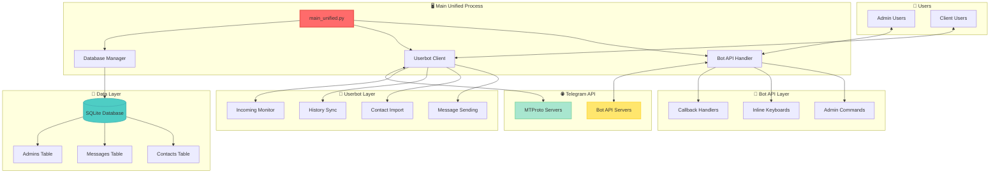

---

## 🔄 Поток данных

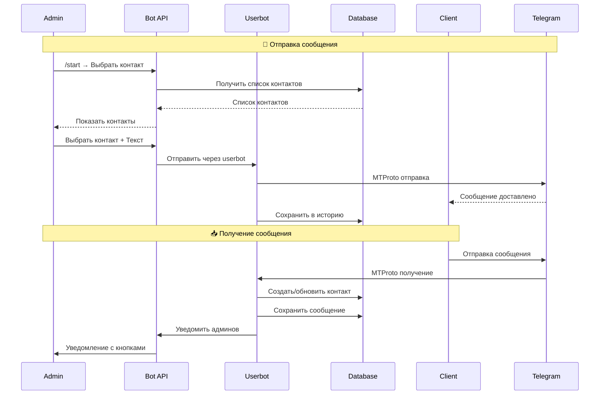

---

## 📊 Схема базы данных

```mermaid
erDiagram
    CONTACTS ||--o{ MESSAGES : has
    ADMINS ||--o{ SESSIONS : manages
    
    CONTACTS {
        int id PK
        string name
        string phone
        string note
        bigint telegram_user_id
        datetime date_added
    }
    
    MESSAGES {
        int id PK
        int contact_id FK
        bigint message_id
        string direction
        text content
        string media_type
        datetime timestamp
    }
    
    ADMINS {
        int id PK
        string username
        bigint telegram_user_id
        datetime date_added
    }
    
    SESSIONS {
        int id PK
        string session_data
        datetime created_at
        datetime expires_at
    }
```

---

## 🎯 Возможности системы

### 📋 Управление контактами

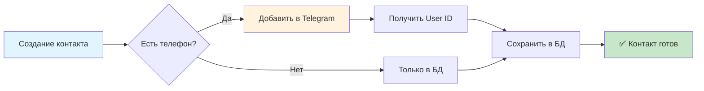

**Функции:**
- ✅ Создание карточек (имя, телефон, примечание)
- ✅ Автоматическое добавление в Telegram с получением User ID
- ✅ Массовый импорт из CSV/Excel
- ✅ Дедупликация контактов
- ✅ Просмотр с пагинацией (10 контактов на страницу)
- ✅ Поиск по всем полям с регулярными выражениями
- ✅ Статистика по контактам с Telegram статусом
- ✅ Экспорт в различные форматы

### 💬 Система сообщений

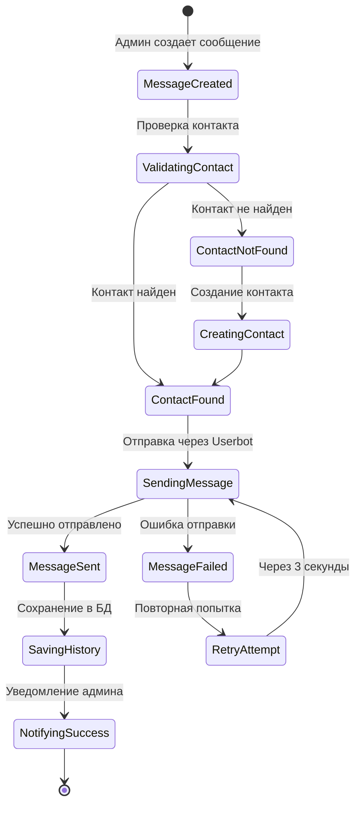

**Возможности:**
- ✅ Отправка через userbot (обход всех ограничений Bot API)
- ✅ Поддержка текста, изображений, файлов
- ✅ Массовая рассылка с защитой от флуда
- ✅ Шаблоны сообщений с переменными
- ✅ Отложенная отправка
- ✅ Автоматические ответы
- ✅ Мониторинг доставки
- ✅ Статистика открытий и ответов

### 👥 Работа с клиентами

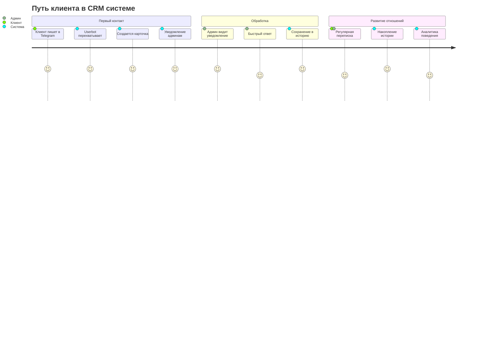

**Функциональность:**
- ✅ Автоматическое создание карточек для новых клиентов
- ✅ Интерактивные уведомления с кнопками быстрого ответа
- ✅ Детальные карточки со статистикой сообщений
- ✅ Синхронизация истории чатов из Telegram
- ✅ Теги и категории клиентов
- ✅ Воронка продаж
- ✅ Задачи и напоминания
- ✅ Интеграция с календарем

### 🛡️ Администрирование

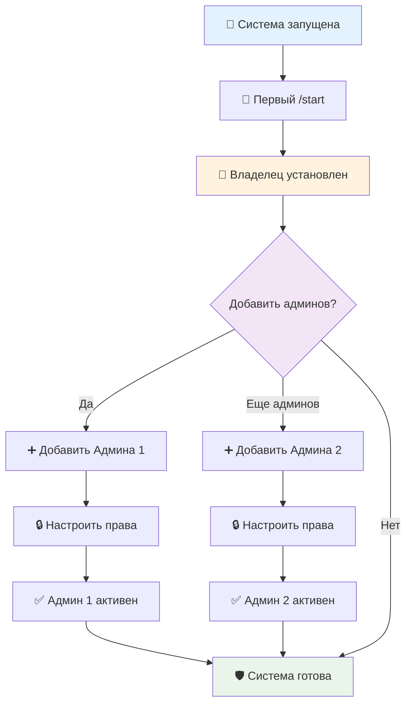

**Возможности:**
- ✅ Система ролей: Владелец → Администраторы → Операторы
- ✅ Гранулярные права доступа
- ✅ Команды управления через бота и веб-интерфейс
- ✅ Защита от дублированных администраторов
- ✅ Аудит всех действий с временными метками
- ✅ Резервное копирование данных
- ✅ Мониторинг производительности
- ✅ Уведомления о критических событиях

---

## 📋 Технические требования

### Минимальные требования
- **Python:** 3.8+ (рекомендуется 3.11+)
- **RAM:** 512 MB
- **Диск:** 1 GB свободного места
- **Интернет:** Стабильное подключение

### API Requirements
- **Bot Token:** От [@BotFather](https://t.me/BotFather)
- **API Credentials:** От [my.telegram.org](https://my.telegram.org)
- **Phone Number:** Для userbot авторизации

### Зависимости
```python
aiogram>=3.1.1          # Bot API framework
telethon>=1.31.1        # MTProto userbot
loguru>=0.7.0           # Advanced logging
aiofiles>=23.1.0        # Async file operations
aiohttp>=3.8.5          # HTTP client
cryptg>=0.4.0           # Crypto acceleration
```

---

## 🚀 Установка и настройка

### 1. Клонирование репозитория

```bash
git clone https://github.com/wh0mever/telegram-crm.git
cd telegram-crm
```

### 2. Установка зависимостей

```bash
# Создание виртуального окружения
python -m venv venv

# Активация (Windows)
venv\Scripts\activate

# Активация (Linux/macOS)  
source venv/bin/activate

# Установка зависимостей
pip install -r requirements.txt
```

### 3. Конфигурация

Откройте `Config.py` и настройте параметры:

```python
# ========================================
# 🔑 ОСНОВНЫЕ НАСТРОЙКИ
# ========================================

# Режим всегда "bot" для объединенной системы
BOT_MODE = "bot"

# ========================================
# 🤖 BOT API (Админский интерфейс)
# ========================================
BOT_TOKEN = "111111111111111111111"

# ========================================  
# 👤 USERBOT API (Отправка сообщений)
# ========================================
API_ID = 1111111111111111111
API_HASH = "11111111111111111111"
PHONE_NUMBER = "+111111111"

# ========================================
# 🌐 СЕРВЕРЫ TELEGRAM  
# ========================================
TELEGRAM_SERVER_MODE = "production"  # production/test
CONNECTION_RETRIES = 5
CONNECTION_TIMEOUT = 30
FLOOD_SLEEP_THRESHOLD = 60

# ========================================
# ⚡ ПРОИЗВОДИТЕЛЬНОСТЬ
# ========================================
MESSAGE_SEND_DELAY = 3              # Задержка между сообщениями
CONTACTS_PER_PAGE = 10              # Контактов на странице
MESSAGE_HISTORY_LIMIT = 20          # Сообщений в истории
MAX_SEND_ATTEMPTS = 3               # Попыток отправки
```

### 4. Первый запуск

```bash
python main_unified.py
```

**Процесс авторизации:**
1. Система запросит код подтверждения
2. Введите код из Telegram
3. При необходимости - пароль 2FA
4. Сессия автоматически сохранится

### 5. Инициализация владельца

Отправьте `/start` боту в Telegram - владелец установится автоматически.

---

## 💡 Подробное руководство по использованию

### 🏠 Главное меню

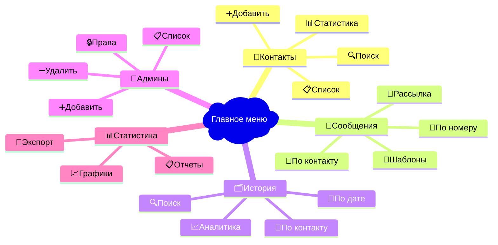

### 📇 Управление контактами

#### Создание контакта

**Через интерфейс:**
1. Контакты → ➕ Добавить контакт
2. Введите данные в формате:
   ```
   Иван Петров
   +79001234567
   Важный клиент, интересуется услугой А
   ```

**Автоматически происходит:**
- ✅ Добавление в Telegram через userbot
- ✅ Получение telegram_user_id
- ✅ Сохранение в базе данных
- ✅ Проверка на дубликаты

#### Массовый импорт

```csv
name,phone,note
"Анна Смирнова","+79001111111","VIP клиент"
"Петр Иванов","+79002222222","Новый лид"
"Мария Козлова","+79003333333","Постоянный клиент"
```

**Импорт через команду:**
```bash
python import_contacts.py contacts.csv
```

### 💬 Отправка сообщений

#### Через интерфейс бота

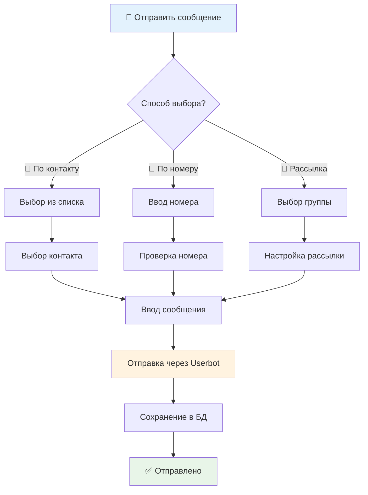

#### Программный API

```python
from telegram_crm import CRMBot

bot = CRMBot()

# Отправка одному контакту
await bot.send_message(
    contact_id=123,
    text="Привет! Как дела?",
    media_url="https://example.com/image.jpg"
)

# Массовая рассылка
await bot.broadcast_message(
    contact_ids=[123, 456, 789],
    text="Важное объявление для всех!",
    delay=3  # Задержка между отправками
)
```

### 🗂️ Работа с историей

#### Просмотр истории чата

**Функции просмотра:**
- 📖 История конкретного контакта
- 📅 История за период
- 🔍 Поиск по тексту сообщений
- 📈 Статистика переписки

**Синхронизация:**
```python
# Автоматическая синхронизация при просмотре
await sync_chat_history(contact_id, telegram_user_id)

# Ручная синхронизация всех чатов
await sync_all_chats()
```

### 👥 Управление администраторами

#### Добавление администратора

**Через команду:**
```bash
/add_admin 123456789
```

**Через интерфейс:**
1. Администраторы → ➕ Добавить
2. Введите Telegram ID
3. Настройте права доступа

**Права доступа:**
- 🏠 **Владелец:** Полный доступ ко всему
- 👑 **Администратор:** Управление контактами и сообщениями
- 👤 **Оператор:** Только просмотр и отправка сообщений

---

## 📊 Мониторинг и аналитика

### 📈 Встроенная аналитика

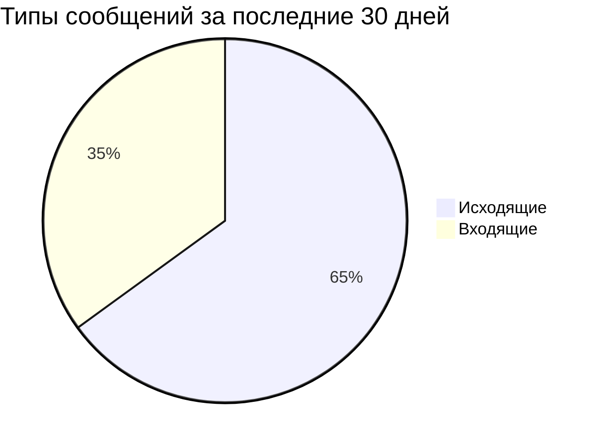

```mermaid
xychart-beta
    title "Активность по дням"
    x-axis [Пн, Вт, Ср, Чт, Пт, Сб, Вс]
    y-axis "Количество сообщений" 0 --> 100
    bar [23, 45, 56, 78, 43, 23, 35]
```

### 📋 Отчеты

**Автоматические отчеты:**
- 📅 Ежедневная сводка активности
- 📊 Еженедельная статистика контактов
- 📈 Месячный отчет по эффективности
- 🎯 Квартальный анализ конверсии

**Экспорт данных:**
```bash
# Экспорт контактов
python export.py contacts --format csv

# Экспорт истории сообщений
python export.py messages --date-from 2024-01-01 --format xlsx

# Полный бэкап системы
python backup.py --full
```

---

## 🔧 Настройки производительности

### ⚡ Оптимизация MTProto

```python
# Рекомендуемые настройки для высокой нагрузки
TELEGRAM_SERVERS = {
    "production": {
        "ip": "123",      # DC 2 (Европа)
        "port": 111,
        "dc_id": 2,
        "ipv6": False
    },
    "alternative": {
        "ip": "111",      # DC 2 Alternative
        "port": 443, 
        "dc_id": 2,
        "ipv6": False
    }
}

# Настройки подключения
CONNECTION_RETRIES = 10             # Больше попыток
CONNECTION_TIMEOUT = 60             # Увеличенный таймаут
FLOOD_SLEEP_THRESHOLD = 120         # Защита от флуда
USE_IPV6 = False                    # Стабильность IPv4
```

### 🚀 Масштабирование

**Для больших объемов:**

```python
# Увеличение лимитов
MAX_CONTACTS_PER_BATCH = 100
MAX_MESSAGES_PER_HOUR = 1000
MESSAGE_SEND_DELAY = 1              # Минимальная задержка

# Оптимизация базы данных  
DB_POOL_SIZE = 20                   # Пул подключений
DB_TIMEOUT = 120                    # Таймаут запросов
AUTO_VACUUM = True                  # Автоочистка БД

# Кэширование
ENABLE_REDIS_CACHE = True           # Redis для кэша
CACHE_TTL = 3600                    # Время жизни кэша
```

---

## 🛠️ Устранение неполадок

### 🚨 Частые проблемы

#### TelegramConflictError

```bash
Error: Conflict: terminated by other getUpdates request
```

**Решение:**
```bash
# Остановить все процессы Python
Get-Process python | Stop-Process -Force

# Очистить временные файлы
rm -rf __pycache__/
rm *.session-journal

# Перезапустить систему
python main_unified.py
```

#### Проблемы с авторизацией userbot

```bash
Error: SessionPasswordNeededError
```

**Решение:**
```python
# В Config.py добавить пароль 2FA
TELEGRAM_2FA_PASSWORD = "your_password"

# Или отключить 2FA временно и перезапустить
```

#### Медленная работа базы данных

```bash
# Оптимизация SQLite
python optimize_db.py

# Создание индексов
python create_indexes.py

# Очистка старых данных
python cleanup.py --older-than 90d
```

### 📝 Логирование

**Структура логов:**
```
logs/
├── crm_unified.log          # Основные логи
├── crm_errors.log          # Только ошибки  
├── crm_performance.log     # Метрики производительности
└── crm_audit.log          # Аудит действий
```

**Просмотр логов в реальном времени:**
```bash
# Общие логи
tail -f logs/crm_unified.log

# Только ошибки
tail -f logs/crm_errors.log | grep ERROR

# Фильтрация по компоненту
tail -f logs/crm_unified.log | grep "userbot"
```

---

## 🔐 Безопасность

### 🛡️ Рекомендации по безопасности

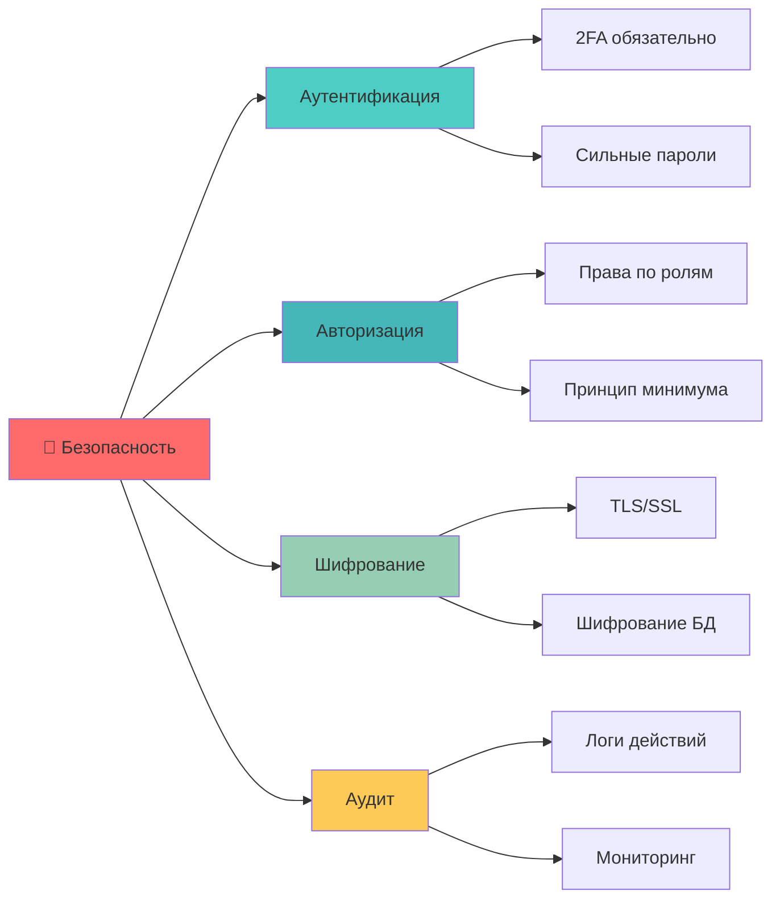

**Checklist безопасности:**
- ✅ Включена двухфакторная аутентификация
- ✅ Регулярное обновление токенов
- ✅ Мониторинг подозрительной активности
- ✅ Резервное копирование данных
- ✅ Ограничение доступа по IP
- ✅ Шифрование чувствительных данных
- ✅ Регулярный аудит прав доступа

### 🔒 Конфиденциальность

**Обработка персональных данных:**
- 📝 Согласие на обработку данных
- 🗑️ Право на удаление данных
- 📋 Ведение реестра обработки
- 🔒 Шифрование персональных данных
- 📊 Анонимизация для аналитики

---

## 🚀 Производственное развертывание

### 🌐 Развертывание на сервере

#### Docker развертывание

```dockerfile
FROM python:3.11-slim

WORKDIR /app
COPY requirements.txt .
RUN pip install -r requirements.txt

COPY . .
EXPOSE 8080

CMD ["python", "main_unified.py"]
```

```yaml
# docker-compose.yml
version: '3.8'
services:
  telegram-crm:
    build: .
    ports:
      - "8080:8080"
    volumes:
      - ./database:/app/database
      - ./logs:/app/logs
    environment:
      - BOT_TOKEN=${BOT_TOKEN}
      - API_ID=${API_ID}
      - API_HASH=${API_HASH}
      - PHONE_NUMBER=${PHONE_NUMBER}
    restart: unless-stopped
```

#### Systemd сервис

```ini
# /etc/systemd/system/telegram-crm.service
[Unit]
Description=Telegram CRM System
After=network.target

[Service]
Type=simple
User=telegram-crm
WorkingDirectory=/opt/telegram-crm
ExecStart=/opt/telegram-crm/venv/bin/python main_unified.py
Restart=always
RestartSec=10

[Install]
WantedBy=multi-user.target
```

```bash
# Активация сервиса
sudo systemctl enable telegram-crm
sudo systemctl start telegram-crm
sudo systemctl status telegram-crm
```

### 📊 Мониторинг в продакшн

```python
# Интеграция с Prometheus
from prometheus_client import Counter, Histogram, start_http_server

messages_sent = Counter('telegram_crm_messages_sent_total')
response_time = Histogram('telegram_crm_response_time_seconds')

# Метрики в коде
messages_sent.inc()
with response_time.time():
    await send_message()
```

---

## 📈 Roadmap развития

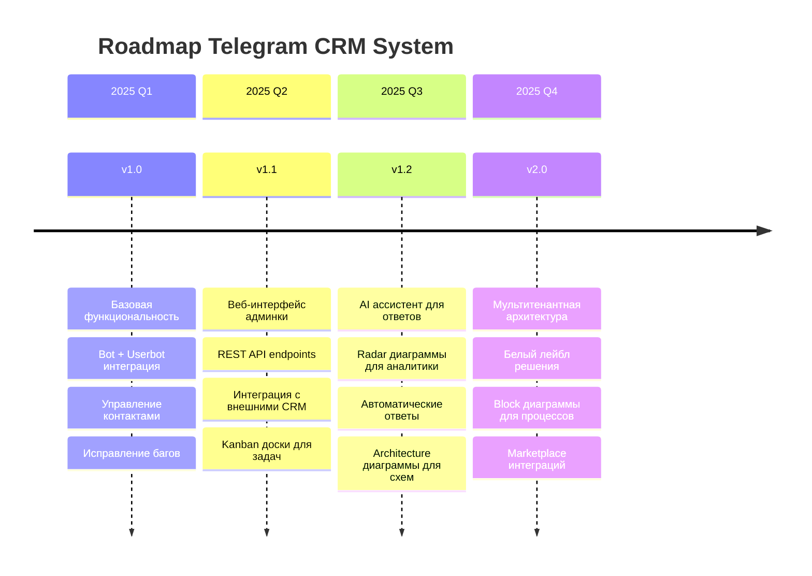

### 🔮 Планируемые функции

**v1.1 - Web Dashboard (Q2 2025):**
- 🌐 Веб-интерфейс для управления с Mermaid 11.6+ диаграммами
- 📊 Kanban доски для отслеживания задач (новая диаграмма Mermaid)
- 🔌 REST API для интеграций
- 📱 PWA мобильное приложение

**v1.2 - AI & Analytics (Q3 2025):**
- 🤖 AI-ассистент для автоматических ответов
- 📡 Radar диаграммы для аналитики клиентов (Mermaid 11.6+)
- 🏗️ Architecture диаграммы для системных схем
- 🧠 Анализ настроения с Block диаграммами

**v2.0 - Enterprise (Q4 2025):**
- 🏢 Мультитенантная архитектура
- 🎨 Белый лейбл решения
- 📦 Packet диаграммы для сетевого анализа
- ☁️ Облачная SaaS версия

---

## 📞 Поддержка и контакты

### 💬 Связь с автором

**Contact:** https://whomever.tech

**GitHub:** [@wh0mever](https://github.com/wh0mever)

**Location:** SAMARKAND, Uzbekistan

### 🐛 Сообщение об ошибках

1. Проверьте [Issues](https://github.com/wh0mever/telegram-crm/issues)
2. Создайте новый issue с:
   - Описанием проблемы
   - Шагами воспроизведения
   - Логами ошибок
   - Версией системы

### 🤝 Вклад в проект

```bash
# 1. Fork репозитория
git clone https://github.com/yourusername/telegram-crm.git

# 2. Создание feature branch
git checkout -b feature/amazing-feature

# 3. Commit изменений
git commit -m 'Add amazing feature'

# 4. Push в branch
git push origin feature/amazing-feature

# 5. Создание Pull Request
```

### 📚 Документация

- 💬 [Telegram канал](https://t.me/wh0mever_dev)
- 🗨️ [Discord сообщество](https://discord.gg/wh0mever)

---

## 📄 Лицензия

```
MIT License

Copyright (c) 2025 Wh0mever

Permission is hereby granted, free of charge, to any person obtaining a copy
of this software and associated documentation files (the "Software"), to deal
in the Software without restriction, including without limitation the rights
to use, copy, modify, merge, publish, distribute, sublicense, and/or sell
copies of the Software, and to permit persons to whom the Software is
furnished to do so, subject to the following conditions:

The above copyright notice and this permission notice shall be included in all
copies or substantial portions of the Software.

THE SOFTWARE IS PROVIDED "AS IS", WITHOUT WARRANTY OF ANY KIND, EXPRESS OR
IMPLIED, INCLUDING BUT NOT LIMITED TO THE WARRANTIES OF MERCHANTABILITY,
FITNESS FOR A PARTICULAR PURPOSE AND NONINFRINGEMENT. IN NO EVENT SHALL THE
AUTHORS OR COPYRIGHT HOLDERS BE LIABLE FOR ANY CLAIM, DAMAGES OR OTHER
LIABILITY, WHETHER IN AN ACTION OF CONTRACT, TORT OR OTHERWISE, ARISING FROM,
OUT OF OR IN CONNECTION WITH THE SOFTWARE OR THE USE OR OTHER DEALINGS IN THE
SOFTWARE.
```

---

## 🎉 Благодарности

**Special thanks to:**
- 📱 [Telegram](https://telegram.org) за потрясающую платформу
- 🐍 [Python](https://python.org) сообщество за инструменты
- 💙 [Telethon](https://github.com/LonamiWebs/Telethon) за MTProto клиент  
- 🤖 [aiogram](https://github.com/aiogram/aiogram) за Bot API framework
- 🔗 Всем контрибьюторам и пользователям системы

---

<div align="center">

**Made with ❤️ in SAMARKAND**

*Если проект оказался полезным, поставьте ⭐ на GitHub!*

[](https://github.com/wh0mever/WHOMEVER_CRM_BOT_v1)
[](https://github.com/wh0mever/WHOMEVER_CRM_BOT_v1)

</div> 
